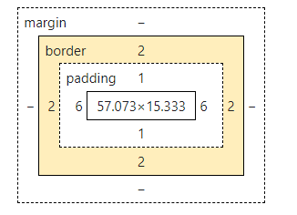

I recently learned that you should do whatever you planned to do in the 20 min after you got up.

Note that you can use `Ctrl F`

This note is based on the video <https://www.youtube.com/watch?v=G3e-cpL7ofc&list=WL&index=2&t=9011s>


## Lecture 1 HTML Basics

We learn the basic sentences now, as `<buttton> Hello</button>` and `<p>paragraph of text</p>`. They are called html element. `<button>` is called a tag, inside which are contents. There should be opening tag and closing tag for each element. 

Next we learn link to another website. eg: `<a href="https://www.youtube.com/">link to youtube</a>`. `href` is called html attribute, modifying how an elemnt bebaves. The url serves as value, which should be inside double quote added to the opening tag. There can be several attributes, which should be separated by space. In this case, we can add the `target` attribute to the value of `"_blank"`,  opening a new tab instead of in the current page. Like latex, extra spaces in the text are ignored. It's ok for the tags and contents to spread several lines.


## Lecture 2 CSS Basics

CSS is short for "Cascading Style Sheets", used to change the appearence of html elements. We learn the `<style>` elememt. We write `<style> button {background-color: red;}</style>` to change the background color of button to red. The `button` is called css selector, denoting which elements we're targeting. The `background-color` is called css property, and `red` css value, together they are called style. Different styles are seperated by semicolon. We can add `color: white;` to change the text color, `border: none;` to erase the border of the button, `height: 50px;` to change the height(px for pixel), `width: 100px;` to change the width, `border-radius: 2px;` to round the corner, `cursof: pointer;` to... If you wonder about some properties, search on Google. 

The get the `style` to modify only certain html element, add the `class` html attribute to the html element, labeling this particular element with any name you provide, say, class_name. Then change `button` to `.class_name-button` or simply `.class_name` inside `<style>`. The styles are often self-explanatory. In css, space is called margin. `margin-right: 8px;` add space to the right of the button, `font-size: 15px;` to change the size of the text.

A general technique is to create html elements and then style them one by one.


## Lecture 3 Hovers, Transitions, Shadows

We next learn to change the style of the button(possibly smoothly and cascading shadow at the same time) when you hover over them. Inside `<style>`, we write `.class_name-button:hover{}`(watch out there's no space after colon), which is called a sudo-class. In the same way, we can write `background-color: green;` and so on. They will apply when you hover over the button. You can also write `.class_name-button:active{}` to change a button's behaviour when you click it. You can use `opacity` to make elements fade. You can add `transition: opacity 1s, background-color, 1;` to the original `button` to make transition smoothly. Note that this kind of setting doesn't apply when you stop hovering if you don't put `transition` in the base css style. you can add `box-shadow: 10px 10px 10px black;` to the hover style to add shadow. For the color, you can use the rgba color, with extra parameter for opacity.


## Lecture 4 Chrome DevTools & CSS Box Model

If you right click a web-page and choose 'inspect', you will find a lot. You can use `margin-right, margin-top` and so on to add margin to all the direction. Using `border-width, border-height` is not quit a good idea. Instead, you should use `padding-left, padding-top` and so on to add space around the text.



The browser in default align according to text. You can add `vertical-align: top` to modify the behaviour.


## Lecture 5 Text Style

Remember you can create text elememts using `<p>text</p>`. You can also add `class` attribute to it. Then, inside `<style>`, write `.class_name{}` to modify the style of the text. Inside, write `fone-family: Arial;` to change the font, `font-size: 30px;` to change font size, `font-weight: bold;` to make font bold, `color: red` to change text color, `font-style: italic;` to make it italic, `text-align: center` to make text center, `width: 400px;` to force the text stretch multiple lines, `line-height: 20px;` to change distance between adjacent lines.

You can also create html entity which is not on your keyboard using special syntax. Note that < and > is html entity.

When you want to apply some property to all your text element, you can write, say, `p{font-family:  Arial;}` inside `<style>` instead of writing the same code for each element. This shows that a single element can be targeted by multiple styles. If two style apply to the same element and have some same property inside it, the browser makes desicion based on the style having the highest priority, not on the sequence in which the code appears. You can use `text-decoration: underline;` to create underline. 

If you give some special property to part of the text, you can create the text element. You can write `<strong> something</strong>` inside `<p>` to make part of the text bold, `<u> something</u>` to create underline. You can also write `<span class="class_name">something</span>` and in css `<style>`, write `class_name{}` to customize the style. You can set `margin-left` for text element to achieve multiple spaces inside the text.


## Lecture 6 HTML Structure

Currently we haven't follow any structure. At the beginning, you should write as follows:

```html
<!DOCTYPE html>
<html>
   <head></head>
   <body></body>
</html>
```

Elements can be nested. `<body>` should contain all the elements that are visible on the page. `<head>` contains all the elements that are not visible. Inside `<head>` you can write `<title>something</title>` to change the text on the tab, which doesn't show up on the page. Note that there should be only one `<html>` element, representing the page.

We  can move all the css code inside `<style>` into a new file, say, button.css. Next we learn the `<link>` element, belonging to the void element, which doesn't need a closing tag. Inside `<head>`, we can write `<link rel="stylesheet" href="button.css">`. `rel=stylesheet` tells the relationship, `href` tells what we are linking in or loading. The `href` value search the file in the current directory. To use relative path,  write `foldername/filename` and so on. 

To load fonts on website, you can visit <https://fonts.google.com/>, copy and paste the code into `<head>`. Then we can access the font we've loaded just like we do with Arial. You can write `font-family: A, B;` so that B will be used if A fails.

## Lecture 7 Images and Text Boxes

To load the image, you can, inside `<body>`, write ``. Note `` is a void element, which doesn't need a closing tag. The `src` is similiar to the `href`but have differences. As always, you are recommended to give a `class` attribute to the `` element. Inside `<style>`, you can write `.class_name{}` to change its property. `width: 300px;` change the image's width, by default maintaining its shape if `height` is not specified. You can write `object-fit: cover;` to maintaining its shape while covering the width and height specified, `object-position: right;` to .., `object-fit:contain;` to... 

To create a text box, inside `<body>` write `<input type="text">`. You can add the attribute `placeholder="something"` to add placeholder to search bar.


## Lecture 8 CSS Display Property

There are 3 main kind of elements in html. The first is called the block element, which takes up the entire line, such as `<p>` by default. The second is the inline-block element which only takes up as much space as needed, such as `` and `<input>`. The third is called the inline element, which appears within a line of text, such as `<strong>` and `<span>`. We can use css  display property to switch between block and inline-block. Inside `class_name{}`, write `display: inline-block;` to set the element to be inline-block.

## Lesson 9 `<div>` elememt

It's really an important html element. `<div>` stands for division, which can be treated just as a box. `<div>` is by default a block. `<div>` can contain any other element inside it, including `<div>` itself. In this way, `<div>` serves as container. So the block element inside `<div>` takes an entirely inside the `<div>` area.


## Lecture 10 Nested Layout Technique

Almost any website can be broken down to combination of vertical and horizontal layout. Creating vertical layout is easy, since `<div>` is block and takes up the entire line(possibly inside another `<div>`). To create horizontal layout, you can make related `<div>` inline-block. You can set the width of a picture to $100\%$ so that it takes up the whole container.


## Lecture 11 CSS Grid

Using inline-block to create horizontal layout has some alignment problems. To create perfect horizontal layout, we use css grid. 

We learn inline styles, another way to write css. For example, inside `<div>`, you can write `<div style="background-color: blue">`, fitting the css as an attribute.

To create a css grid,

```html
<div style=
	"display: grid;
	grid-template-columns: 100px 100px;
     "
	>
    <!-- the number of values decides the number of columns. -->
    <!-- you can also write it inside css -->
  <div>...</div>
  <div>...</div>
</div>
```

If the number of values is greater than the number of `<div>` inside, those left are invisible. If more, more rows will be created automatically. You can replace the `px` with `fr`, causing the corresponding grid to take up the whole free space left of the line. If there are more than one `fr`, the grid with `fr` will take up space proportional to the number before `fr`.

You can add `padding-bottom: 100px` to the style of `body` to create extra space at the bottom of the webpage. We can write `column-gap: 20px;` to create space between columns, `row-gap: 20px` to create spcae between rows.
